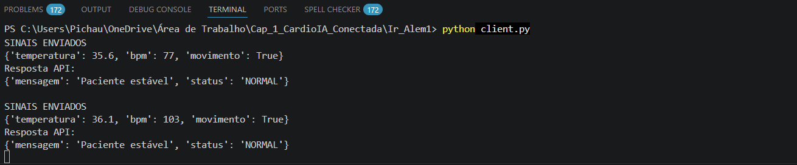
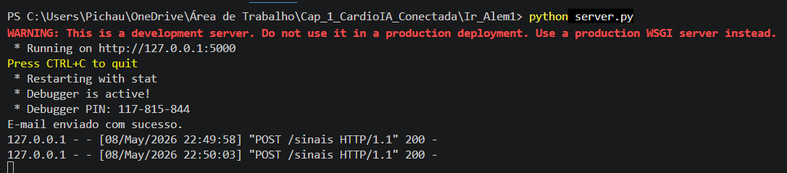
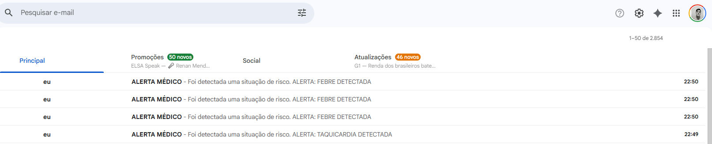
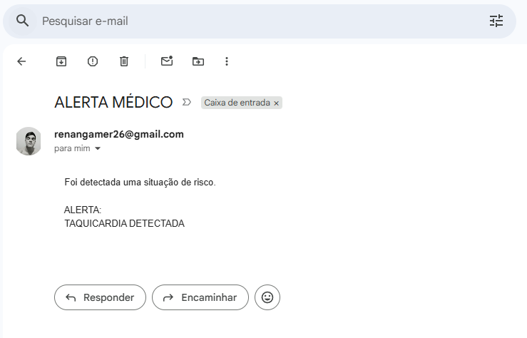
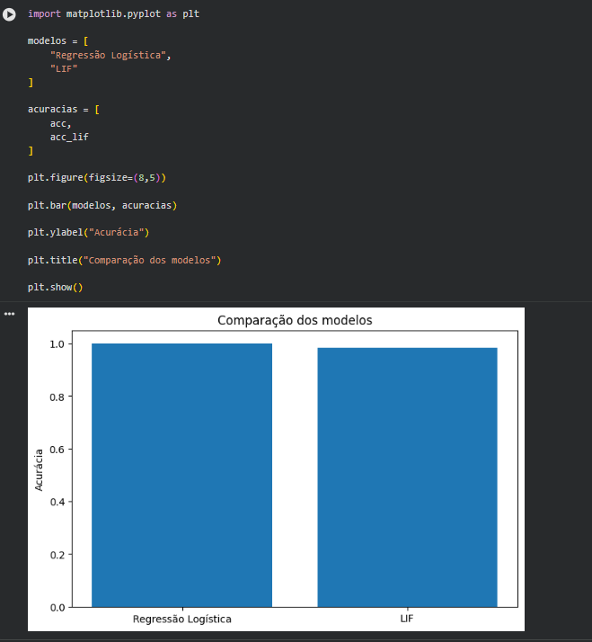

# FIAP - Faculdade de Informática e Administração Paulista

 

# Cap 1 - CardioIA Conectada: IoT e Visualização de Dados para a Saúde Digital

# Integrante: 
- <a href="https://www.linkedin.com/in/renanmendes26/">Renan de Oliveira Mendes - RM563145</a>

# Descrição
Nessa fase, desenvolvi.

Indo além, criamos uma interface moderna com React e Vite. Também desenvolvemos e treinamos um modelo de visão computacional para a análise de exames de eletrocardiograma.

## Parte 1
Criei uma solução que utiliza Edge Computing com ESP32 para monitoramento em aplicações críticas de saúde. O sistema coleta dados localmente através de sensores e continua funcionando mesmo sem conexão com a internet.

**Link do projeto non Wokwi: https://wokwi.com/projects/463496096459659265**

**Relatório com mais detalhes dentro da pasta Parte1**

##### Sensores utilizados

 - Sensor DHT22 para temperatura e umidade 
 - Sensor LDR para luminosidade 

#### Funcionamento
O ESP32 realiza leituras periódicas dos sensores e armazena os dados localmente em memória. Uma variável booleana simula a conectividade Wi-Fi.

Quando o sistema está offline:
-	os dados continuam sendo armazenados localmente 
Quando a conexão retorna:
-	os dados armazenados são enviados para a “nuvem” utilizando o Monitor Serial 
- 	após o envio, os dados locais são apagados 

##### Resiliência Offline

Foi implementada uma estratégia FIFO com capacidade máxima de 10 registros. Quando o armazenamento atinge o limite, os dados mais antigos são removidos automaticamente.
Essa abordagem garante:
-   continuidade operacional 
-	tolerância à falha de rede 
-	baixo consumo de memória

## Parte 2
Na segunda parte desenvolvi e implementei um sistema completo de monitoramento, distribuição e visualização de dados, usando MQTT, HiveMQ e Node-RED.

**Link do projeto non Wokwi: https://wokwi.com/projects/463502084128323585**

**Link do vídeo: https://youtu.be/qpGmhhiO1mw**

**Relatório com mais detalhes dentro da pasta Parte1**

O projeto implementa uma arquitetura IoT utilizando Edge, Fog e Cloud Computing para monitoramento de sinais vitais em tempo real.

O ESP32 realiza coleta de dados locais e transmite informações via protocolo MQTT para um broker em nuvem.

##### Tecnologias utilizadas
- ESP32
- Wokwi
- MQTT
- HiveMQ Cloud
- Node-RED
- Dashboard IoT
- Fluxo MQTT

O ESP32 conecta-se ao Wi-Fi e estabelece comunicação MQTT com o broker HiveMQ Cloud.

Os dados são publicados nos tópicos:

- hospital/temperatura
- hospital/bpm

O Node-RED atua como camada Fog Computing:

- recebe dados
- processa alertas
- atualiza dashboard em tempo real

##### Dashboard

A dashboard apresenta:

- gráfico de BPM
- gauge de temperatura
- alertas críticos

Os alertas são ativados quando:

- BPM > 120
- temperatura > 38°C

##### Conceitos aplicados
1. Edge Computing; 
2. Coleta local no ESP32;
3. Fog Computing;
4. Processamento intermediário no Node-RED;
5. Cloud Computing
6. Broker MQTT HiveMQ Cloud.

## Ir Além

Para o Ir Além implementei um sistema de monitoramento de sinais vitais utilizando comunicação REST em Python.
O sistema simula sensores médicos enviando dados para uma API REST responsável pela análise dos sinais e detecção de riscos.

**Relatório com mais detalhes dentro da pasta Ir_Alem1**

### Fluxo da solução

O cliente Python gera sinais vitais simulados:

- temperatura
- batimentos cardíacos
- movimento

Esses dados são enviados via HTTP POST para a API Flask.

A API processa os sinais e aplica regras de negócio para identificar:

- febre
- taquicardia
- ausência de movimento

Quando uma condição crítica é detectada:

- um e-mail automático é enviado.

### Comunicação REST

A comunicação utiliza:

- protocolo HTTP
- formato JSON
- Endpoint
- Método POST
- Automação de e-mail

A automação utiliza:

- protocolo SMTP
- servidor Gmail

O sistema envia alertas automaticamente para profissionais responsáveis.

## Ir Além 2

No Ir Além 2 realizei o treinamento de dois modelos. O objetivo é comparar técnicas tradicionais de aprendizado de máquina com modelos neuromórficos aplicados à análise de séries temporais de sinais vitais.

**Relatório com mais detalhes dentro da pasta Ir_Alem2**
**Link do vídeo: https://youtu.be/rRensd7oCjk**

Foi utilizada uma base sintética de batimentos cardíacos para classificação entre estados normais e taquicardia.

### Modelos utilizados

- Regressão Logística

Modelo supervisionado tradicional amplamente utilizado para classificação binária.

- Modelo LIF

Modelo neuromórfico inspirado em neurônios biológicos, baseado em acúmulo de potencial elétrico e disparo de spikes.

### Resultados

A regressão logística apresentou maior estabilidade e facilidade de treinamento.

O modelo LIF demonstrou comportamento biologicamente inspirado e boa capacidade de detectar padrões temporais simples.

O projeto demonstra como modelos neuromórficos podem ser aplicados em séries temporais de saúde, embora modelos tradicionais ainda apresentem vantagens em simplicidade e desempenho geral.

# 📁 Estrutura de pastas

Dentre os arquivos e pastas presentes na raiz do projeto, definem-se:

- <b>assets</b>: Imagens relevantes para documentação desse repositório.

- <b>Parte_1</b>: Arquivo txt, csv e código Python referentes ao classificador NPL baseado em regras e mapa ontologico criado.

- <b>Parte_2</b>: Arquivo csv e programa Python classificador NPL probabilistico, usando TF_IDF.

- <b>Ir_Alem</b>: Interface e todo código React + Vite.

- <b>Ir_Alem_2</b>: Notebook python com o modelo MLP para visão computacional.
  

  
## Requisitos
#### Ambiente
- Node.js 20.x ou 22.x LTS (recomendado para Vite 8) + npm
- Python 3.10–3.12 
- Portal web: Node 20/22, React 19, Vite 8, React Router 7. 
- Notebook: Python 3.10–12, pip install -r requirements.txt (pandas, scikit-learn, numpy, JupyterLab).

#### Versões 
- react 19.2.4
- react-dom 19.2.4
- react-router-dom 7.13.2
- pandas 2.1
- scikit-learn 1.4
- numpy 1.26
- jupyterlab 4 

